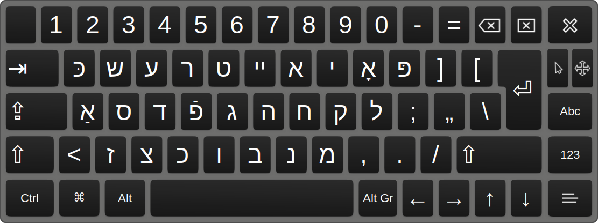

# yiddish-keys-linux

Yiddish keyboard layout for GNU/Linux

Windows and OSX versions: https://gitlab.com/okey_kompyuter/yiddish-klaviator

More info: https://okey.kompyuter.net/klaviatur

**"But didn't you know you can write Yiddish with a Hebrew layout?"**  
**"*Nu*, tell me something I don't know!"**

Like a frozen forest bare of birds and leaves, Yiddish orthography on the internet 
has shed its defining hats, dots and strikes because of the lack of alternatives 
to Modern Hebrew layouts, for which all such things are superfluous. Not only that, 
but Hebrew's prioritization of different letters to Yiddish means that typing is so
frustrating for many that they prefer typing in Latin characters than Hebrew. 
Transliteration hurts the language&mdash;it prevents the development of literacy, 
especially for those who come to the language as students rather than through birth.

This Yiddish keyboard hopes to address this by providing an intuitive and eventually
standard Yiddish keyboard for all major OSs to ultimately, it is hoped, include 
as a vanilla feature.

This is a pared-down version of [heyheydanhey](https://gitlab.com/okey_kompyuter/yiddish-keys-linux)'s version&mdash;just the QWERTY layout. 

Some minor changes which I think make more sense:

- `V` is now mapped to װ
- `Shift+A` is now א
- `U` and `Shift+U` are ו and וּ respectively
- `Shift+O` is now ױ, a ligature previously not included

## Installation

On Ubuntu-based systems, at least:

 1) RECOMMENDED: Back up your /usr/share/X11/xkb directory, just in case you experience any problems after installation.
   
 2) Run ```chmod +x install.sh``` and ```./install.sh```
  
 3) Open your keyboard layout dialogue. It might be in Preferences > Keyboard > Keyboard layouts.
 
 4) Add a new layout (+) > search for Yiddish > choose the default layout.
 
Toggle between your keyboard layouts in the taskbar.

## Screenshots



## To do

- [ ] Add uninstall script  
- [ ] Figure out if `sudo dpkg-reconfigure xkb-data` actually does anything  
- [ ] Add some flair to script output